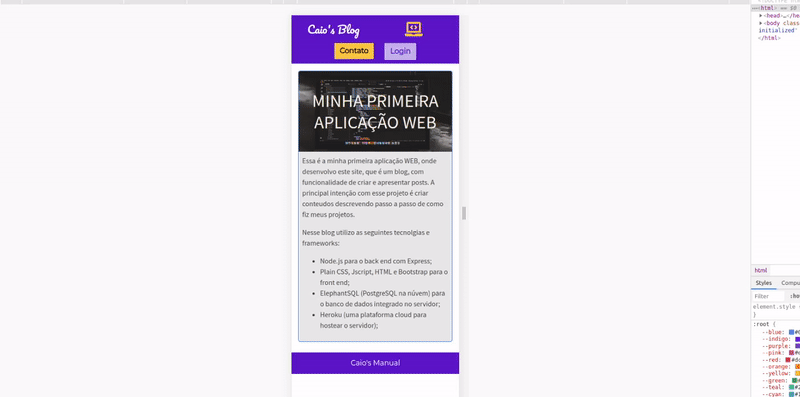

# MyBlog

Hello!, this is the very first project I've done after completing my first course of web development.

My intention here was to create my personal blog, where I can expose my knoweledge

I built this web app using Express.js as a web server, and in the front-end I used Bootstrap and plain
HTML. I've built also an cloud database on ElephantSQL 

This website has a login page, posta page, authentication, the password is encrypted when saved in the
database, and a lot of things more in my very first online project.

You can see the version I've create in -> caiosblog.herokuapp.com (but the version are diferent from the
github)

